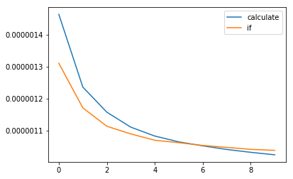

## Description
Given a binary matrix ``A``, we want to flip the image horizontally, then invert it, and return the resulting image.

To flip an image horizontally means that each row of the image is reversed.  For example, flipping ``[1, 1, 0]``horizontally results in ``[0, 1, 1]``.

To invert an image means that each ``0`` is replaced by ``1``, and each 1 is replaced by 0. For example, inverting ``[0, 1, 1]`` results in ``[1, 0, 0]``.

**Example 1:**

```
Input: [[1,1,0],[1,0,1],[0,0,0]]
Output: [[1,0,0],[0,1,0],[1,1,1]]
Explanation: First reverse each row: [[0,1,1],[1,0,1],[0,0,0]].
Then, invert the image: [[1,0,0],[0,1,0],[1,1,1]]
```

**Example 2:**

```
Input: [[1,1,0,0],[1,0,0,1],[0,1,1,1],[1,0,1,0]]
Output: [[1,1,0,0],[0,1,1,0],[0,0,0,1],[1,0,1,0]]
Explanation: First reverse each row: [[0,0,1,1],[1,0,0,1],[1,1,1,0],[0,1,0,1]].
Then invert the image: [[1,1,0,0],[0,1,1,0],[0,0,0,1],[1,0,1,0]]
```

**Notes:**

- ``1 <= A.length = A[0].length <= 20``

- ``0 <= A[i][j] <= 1``

## Solutions
```python
class Solution(object):
    def flipAndInvertImage(self, A):
        """
        :type A: List[List[int]]
        :rtype: List[List[int]]
        """
        for item in A:
            item.reverse()
            for i in range(len(item)):
                item[i] = 1-item[i]
        return A

```

这个思路也很简单粗暴。跟问题描述里的步骤一样一步一步来。

```python
class Solution(object):
    def flipAndInvertImage(self, A):
        for row in A:
            for i in xrange((len(row) + 1) / 2):
                """
                In Python, the shortcut row[~i] = row[-i-1] = row[len(row) - 1 - i]
                helps us find the i-th value of the row, counting from the right.
                """
                row[i], row[~i] = row[~i] ^ 1, row[i] ^ 1
        return A
```

官方给出的解法就是真的很简洁了。注释中说明了``row[~i] = row[-i-1] = row[len(row) - 1 - i]`` 利用了python的一个特性完成了这个任务。在invert步骤用了``^``操作符来完成。又学到了。

后来在看Discuss的时候发现绝大多数人在invert步骤用的都是``if``语句来判断，但是我测试发现并没有我的快。于是我研究了一下。



上图是十次用if和减法做相同的事情，平均所需时间的图表。可以看见直接用减法做速度要快一点，我重复了多遍，几乎都是这个结果。
所以以后喷到类似的问题的时候，该用丑一点的方法就用丑一点的方法，毕竟比较快。