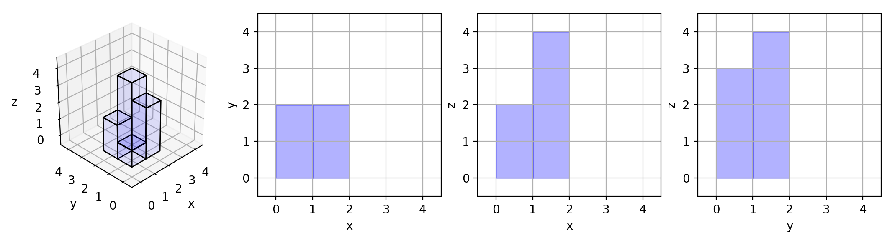

# 883. Projection Area of 3D Shapes

## Description

On a ``N * N`` grid, we place some ``1 * 1 * 1`` cubes that are axis-aligned with the x, y, and z axes.

Each value ``v = grid[i][j]`` represents a tower of v cubes placed on top of grid cell ``(i, j)``.

Now we view the projection of these cubes onto the xy, yz, and zx planes.

A projection is like a shadow, that maps our 3 dimensional figure to a 2 dimensional plane. 

Here, we are viewing the "shadow" when looking at the cubes from the top, the front, and the side.

Return the total area of all three projections.

**Example 1:**

```
Input: [[2]]
Output: 5
```

**Example 2:**

```
Input: [[1,2],[3,4]]
Output: 17
Explanation: 
Here are the three projections ("shadows") of the shape made with each axis-aligned plane.
```


**Example 3:**

```
Input: [[1,0],[0,2]]
Output: 8
```
**Example 4:**
```
Input: [[1,1,1],[1,0,1],[1,1,1]]
Output: 14
```

**Example 5:**
```
Input: [[2,2,2],[2,1,2],[2,2,2]]
Output: 21
```

**Note:**

- 1 <= grid.length = grid[0].length <= 50

- 0 <= grid[i][j] <= 50

## Solutions

```python
class Solution(object):
    def projectionArea(self, grid):
        """
        :type grid: List[List[int]]
        :rtype: int
        """
        num = len(grid)*len(grid[0])
        z = 0
        x = 0
        y = 0
        for i in range(len(grid[0])):
            x += max(grid[i][:])
            y += max([t[i] for t in grid])
            z += grid[i][:].count(0)
        return x+y+num-z
```

这个题目绕来绕去的，看了好一会才弄懂。其实就是分别求每行每列的最大值之和加上非零元素个数。如果用了numpy包，估计两三行就写完了，不用的化就只能手动来求行列的最大值。

```python
class Solution:
    def projectionArea(self, grid):
        """
        :type grid: List[List[int]]
        :rtype: int
        """
        xy = sum(v>0 for row in grid for v in row)
        xz = sum(max(row) for row in grid)
        yz = sum(max(col) for col in zip(*grid))        
        return xy + xz + yz
```

disscuss中有个看起来很简洁的解法，但是其实展开来长这样：

```python
class Solution:
    def projectionArea(self, grid):
        """
        :type grid: List[List[int]]
        :rtype: int
        """
        m, n = len(grid), len(grid[0])
        xy = 0
        for i in range(m):
            for j in range(n):
                if grid[i][j]!=0:
                    xy += 1
        xz = sum([max(row) for row in grid])
        yz = sum([max([grid[i][j] for i in range(m)]) for j in range(n)])
        return xy + xz + yz
```

让我很不解的是，这个解法明明时间复杂度比我大得多，但是不知道为啥运行速度比我快。嘤嘤嘤